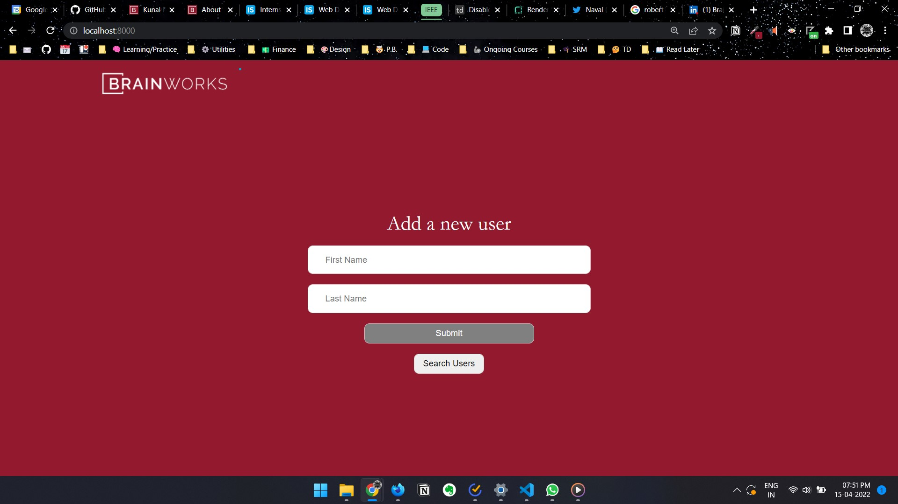
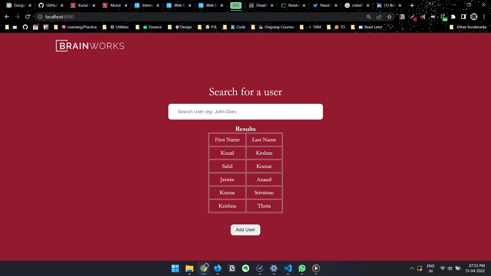

# Brainworks World Internship Submission

Software Development Live Projects Opportunity
April 2022

Table of Contents:

- [Task Output](#task-output)
  - [Task 1](#task-1)
  - [Task 2](#task-2)
- [Selection Tasks](#selection-tasks)
  - [Task 1](#task-1-bootstrap-js-google-sheets-api)
  - [Task 2](#task-2-uiux-seo-design-sense-htmlcss)

## Task Output

### Task 1: Bootstrap JS Google Sheets API

Check the working project at: 

Access to [Google Sheets](https://docs.google.com/spreadsheets/d/1T44FMKLS_nwWpUZh8QGgA7PPsKy5IKl4UTWtc_-j22A/edit?usp=sharing) associated with this file.

| Save Section | Fetch Section |
| --- | --- |
|  |  |

Here's the Zip File: [kunal-keshan-task-1](./kunal-keshan-task-1.rar)

### Task 2: UI/UX/SEO Design Sense HTML/CSS

[Access the word file](./Brainworks%20World%20Website%20Analysis.docx) and see the analysis.
If you're not able to access the file, [here's the drive link](https://docs.google.com/document/d/1OH6suuHVEL0ctM2hHtYoxS27nZ6mPpTJBU4GJoOjGbY/edit?usp=sharing) to it.

## SELECTION TASKS

### Task 1: Bootstrap, JS, Google Sheets API

Testing your existing skills and how quickly you can plug any skill gaps

1. Create a simple webpage with two sections:
  a. Save: Create two input fields in it: Firstname and Lastname, and a Save button
  b. Fetch: Create one input field in it: Firstname, and a Fetch button

2. When the user clicks on the Save button in the Save section, the data entered by the user should get saved in a Google Sheet using their API. The format of the sheet should be (example names are provided only for illustration):

| Firstname | Lastname |
| --- | --- |
|John | Doe|
| Samantha | Collins |

3. When the user enters a Firstname in the Fetch section, your code should fetch the corresponding Lastname from the same Google Sheet. The fetched Lastname should be printed on the webpage.

4. Imagine some scenarios in which the above system may fail and implement user-friendly solutions. Make reasonable assumptions wherever required.

- Technologies you must use: HTML, CSS, JS (and no other technology)
- Make sure you write beautiful code that is self-explanatory!
- You need to submit a zipped folder with all your assets in it. Please name your webpage as index.html.
- Name your submission as <Your Name>-Task-1.zip (kunal-keshan-task-1.zip)

### Task 2: UI/UX, SEO, Design Sense, HTML/CSS

Testing your analysis, observation, design sense, knowledge and technical skills
Visit [www.brainworks.world](www.brainworks.world) and enlist a total of 8-10 issues (or scope of improvement) that you see on the homepage.

These issues can be in relation to UI, UX, SEO, Design, Code, Responsiveness, or anything else! Note that you only need to list the issues and not the solutions.
You need to submit a Word file with the list of issues. Feel free to use screenshots to better demonstrate your points, wherever required. Name your submission as <Your Name>-Task-2.docx (kunal-keshan-task-2.docx)
